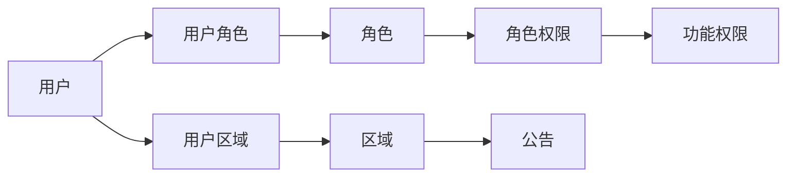

# 后台权限管理系统

本项目基于 `examples-next-prisma-starter`，实现两条独立但可组合的授权链：



- 功能权限回答“能不能调用这个接口”。
- 数据权限回答“调用接口后能看见或修改哪些区域的数据”。
- 公告同时经过两层校验，是完整授权链的观测点。

## 快速启动

前置条件：Node.js、pnpm、Docker Desktop。

```bash
pnpm install
pnpm db:up
pnpm migrate
pnpm db-seed
pnpm exec next dev -p 3001
```

打开 [http://localhost:3001](http://localhost:3001)。如果改用其他端口，需要同步设置 `BETTER_AUTH_URL`。

## 演示账号

以下账号仅用于本地培训数据库：

| 账号 | 密码 | 角色与数据范围 | 可观察效果 |
| --- | --- | --- | --- |
| `admin@example.com` | `PermissionAdmin2026!` | 系统管理员；重庆、北京 | 可进入五个模块并维护全部关系 |
| `editor@example.com` | `RegionalEditor2026!` | 区域公告编辑；仅重庆 | 可发布公告，但列表中完全没有北京公告 |
| `viewer@example.com` | `AnnouncementViewer2026!` | 公告只读；仅北京 | 只能看到北京公告，没有写操作 |
| `limited@example.com` | `LimitedAccess2026!` | 无角色、无区域 | 登录成功，但没有可进入的业务模块 |

## 明确契约

### 注册与登录

- 密码长度为 15-64 个字符；允许 Unicode 和空格，不要求大小写或特殊字符组合。
- 重复邮箱在转为小写后返回 `CONFLICT / EMAIL_ALREADY_REGISTERED`。
- 未知邮箱、错误密码、禁用账号对外都返回相同的登录失败信息，不泄露账号是否存在。
- 禁用用户时，在同一事务中删除该用户全部 Session，旧 Cookie 随即失效。

### 关联与删除

- `UserRole`、`RolePermission`、`UserRegion` 是三组关系的唯一数据源。
- 从用户侧或资源侧替换关联，都会操作同一张中间表，因此双向查询结果一致。
- 关联替换先验证所有 ID，再在一个事务中整体替换；任一 ID 不存在时原关系不变。
- 被引用的角色、权限点、区域不能删除，返回 `CONFLICT / RESOURCE_IN_USE` 和引用计数。
- 用户不做物理删除，以禁用保留公告作者和关联历史。

### 权限执行位置

| 层次 | 作用 | 真实效果 |
| --- | --- | --- |
| Better Auth Session | 确认调用者身份 | 无 Session 或已禁用用户得到 `UNAUTHORIZED` |
| tRPC `permissionProcedure` | 校验功能权限点 | 缺少权限得到 `FORBIDDEN / MISSING_PERMISSION:*`，业务代码不执行 |
| Prisma `regionId IN ctx.regionIds` | 约束公告数据范围 | 越权列表无任何记录或元数据；越权详情/更新/删除返回 `NOT_FOUND` |

页面隐藏菜单和按钮只是交互便利，不承担安全职责。即使绕过页面直接请求 API，上述服务端检查仍然生效。

## 权限点

| 模块 | 读取 | 写入/状态 | 关联维护 |
| --- | --- | --- | --- |
| 用户 | `user:read` | `user:update` | `user:manage-roles`、`user:manage-regions` |
| 角色 | `role:read` | `role:write` | `role:manage-permissions` |
| 权限点 | `permission:read` | `permission:write` | 通过角色维护 |
| 区域 | `region:read` | `region:write` | `user:manage-regions` |
| 公告 | `announcement:read` | `announcement:write` | 受当前用户区域集合约束 |

## 工具箱：作用与效果

| 工具 | 在工作流中的作用 | 本项目留下的效果/证据 |
| --- | --- | --- |
| Agent Reach 1.5.0 | 调研 GitHub、技术文档和跨平台资料 | `doctor` 显示 14/15 渠道可用；用 Exa/GitHub 核对 RBAC、Better Auth、Prisma 的成熟做法 |
| OpenSpec 1.6.0 | 先声明行为契约，再按任务实现 | `openspec/changes/build-permission-admin/` 包含 proposal、design、capability specs、tasks；`openspec validate` 通过 |
| Better Auth 1.6.23 | 密码哈希、数据库 Session、HttpOnly Cookie | 浏览器登录后可调用 tRPC；禁用后 Session 被删除；数据库不存明文密码 |
| Prisma + PostgreSQL | 数据模型、事务、外键和区域过滤 | 三张显式中间表可反查；关联替换原子化；公告查询在数据库边界过滤 |
| tRPC + Zod | 类型安全接口、输入校验、鉴权中间件 | 非法输入在写库前被拒绝；前后端共享接口类型；错误码可区分 |
| Vitest | 接口级行为验证 | 20 个测试覆盖注册、登录、禁用、CRUD、三组关联、删除冲突和跨区越权 |
| Playwright | 浏览器端全链路验收 | 5 个场景覆盖登录、无权限导航、区域隔离、手机布局和双向反查 |
| Playwright Test Agents | 为 Codex 提供测试规划、生成、修复工具 | `.codex/agents/` 中有 planner、generator、healer 配置；生成结果仍需人工审核 |
| Lucide React | 使用熟悉的操作图标 | 编辑、删除、退出等按钮具有一致图标、可访问名称和悬停说明 |
| Docker Compose | 隔离本地 PostgreSQL | `permission-admin-db` 只监听 `127.0.0.1:15433`，可重复迁移与播种 |

另外安装了 TDD、系统化调试、完成前验证和代码审查技能。它们不进入生产包，只约束 AI 开发过程：先看到测试失败、定位根因、再实现并用完整命令证明完成。

## 验证命令

```bash
pnpm test:run
pnpm lint
pnpm typecheck
pnpm build

# 已有本地 3001 服务时
PLAYWRIGHT_HEADLESS=1 PLAYWRIGHT_PORT=3001 \
PLAYWRIGHT_BASE_URL=http://localhost:3001 TEST_LOCAL=1 pnpm test-e2e

openspec validate build-permission-admin
```

Windows PowerShell 中把每个环境变量写成 `$env:NAME='value'` 后再执行 `pnpm test-e2e`。

## 考核讲解顺序

1. 先画两条授权链，强调角色不直接等于权限点，区域也不等于功能权限。
2. 用管理员从用户侧绑定角色和北京区域，再到角色页、区域页展示反查一致。
3. 用无权限账号说明“能登录”不等于“能调用业务接口”。
4. 用重庆编辑账号展示公告列表没有北京数据，并说明过滤条件位于 Prisma 查询而非前端。
5. 尝试删除仍被引用的角色或区域，解释 `RESOURCE_IN_USE` 和引用计数。
6. 禁用一个账号，说明状态更新与 Session 删除处于同一事务。

核心实现入口：

- `src/server/context.ts`：每次请求重新加载用户、有效权限集合和区域集合。
- `src/server/trpc.ts`：身份与功能权限中间件。
- `src/server/routers/announcement.ts`：功能权限和数据权限的组合执行。
- `prisma/schema.prisma`：实体、三组关联和外键删除策略。
- `playwright/permission-admin.spec.ts`：可重复的浏览器验收证据。
